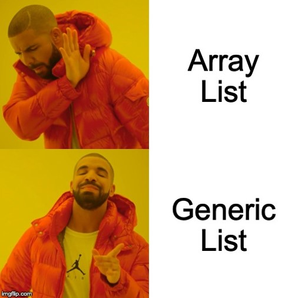

# What if we NEED to Add and Remove?

* Array Lists [System.Collections.ArrayList] ==> This is Depreciated
* Generic Lists [System.Collections.Generic.List<type>]
  * `PS> $NewArray = [System.Collections.Generic.List[String]]::New()`
  * `PS> $NewArray = [System.Collections.Generic.List[int]]::New()`
  * `PS> $NewArray = [System.Collections.Generic.List[PSObject]]::New()` -->
